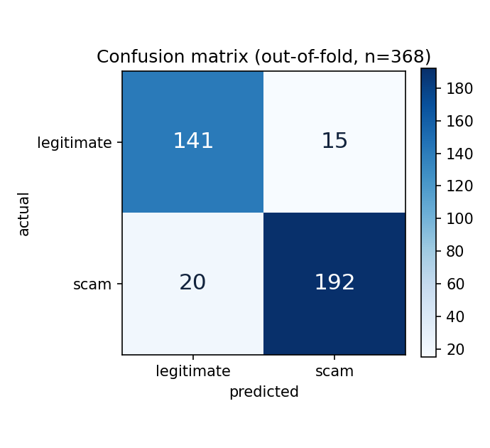
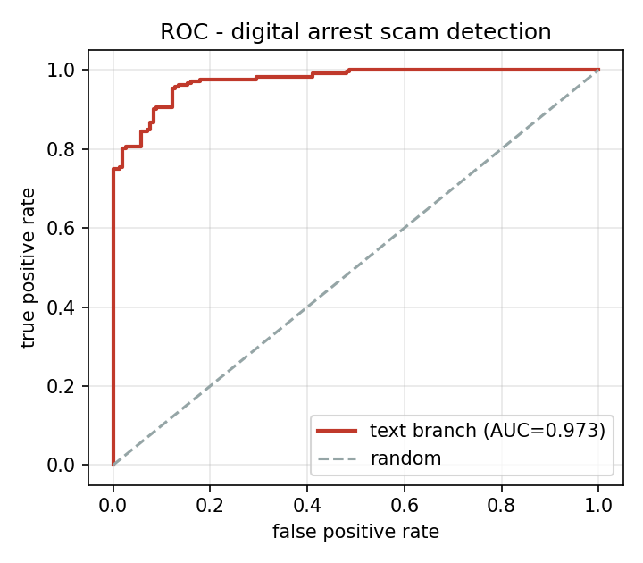
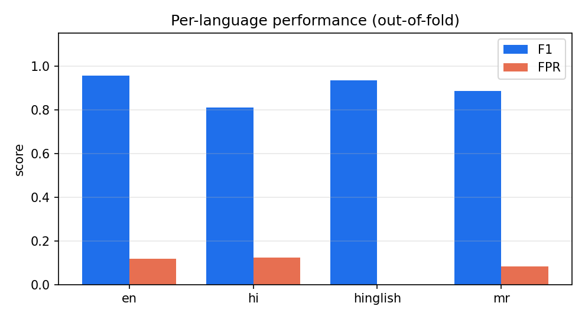
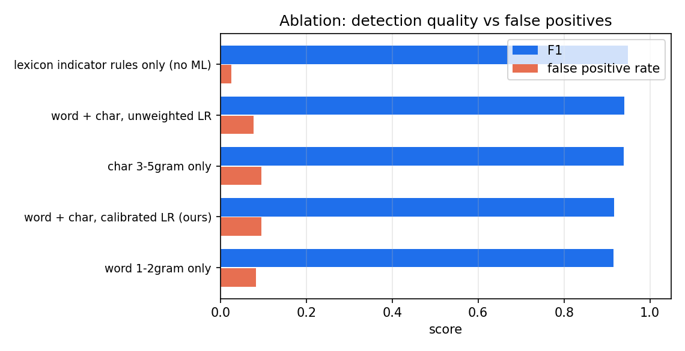

# Phase 1 Results - Digital Arrest Scam Detection (text branch)

Generated by `python -m src.evaluate`.

- Corpus: **368 samples**, **92 base calls** (212 scam / 156 legitimate), 4 languages (en, hi, mr, hinglish)
- Validation: **5-fold StratifiedGroupKFold**, grouped by base call
- Group leakage across folds: **0** (must be 0)

Grouping matters: augmented variants of one utterance share a `group_id`, so
near-duplicates can never straddle the train/test boundary.

## 1. Out-of-fold results

| Accuracy | Precision | Recall | F1 | AUC | FPR | n |
|---|---|---|---|---|---|---|
| 0.905 | 0.928 | 0.906 | 0.916 | 0.973 | **0.096** | 368 |

Operating threshold **0.69** (maximises F1 subject to FPR <= 10%, chosen on
out-of-fold scores so no single fold defines the operating point).

Confusion counts: **TP=192 FP=15 FN=20 TN=141**

## 2. Per-language breakdown

| Language | Accuracy | Precision | Recall | F1 | AUC | FPR | n |
|---|---|---|---|---|---|---|---|
| 0.946 | 0.922 | 0.991 | 0.955 | 0.990 | **0.118** | 184 |
| 0.806 | 0.882 | 0.750 | 0.811 | 0.928 | **0.125** | 72 |
| 0.929 | 1.000 | 0.875 | 0.933 | 1.000 | **0.000** | 56 |
| 0.875 | 0.931 | 0.844 | 0.885 | 0.965 | **0.083** | 56 |

Coarse language identification accuracy across the corpus: **91.8%**

## 3. Ablation

| Configuration | Accuracy | Precision | Recall | F1 | AUC | FPR | thr |
|---|---|---|---|---|---|---|---|
| lexicon indicator rules only (no ML) | 0.943 | 0.980 | 0.920 | 0.949 | 0.955 | 0.026 | 0.07 |
| word + char, unweighted LR | 0.932 | 0.943 | 0.939 | 0.941 | 0.980 | 0.077 | 0.64 |
| char 3-5gram only | 0.929 | 0.931 | 0.948 | 0.939 | 0.985 | 0.096 | 0.58 |
| word + char, calibrated LR (ours) | 0.905 | 0.928 | 0.906 | 0.916 | 0.973 | 0.096 | 0.69 |
| word 1-2gram only | 0.905 | 0.936 | 0.896 | 0.916 | 0.966 | 0.083 | 0.58 |

## 4. Cross-domain generalisation (untouched public corpus)

Source: `dbarbedillo/SMS_Spam_Multilingual_Collection_Dataset` (UCI SMS Spam
Collection, M2M100 translations to en/hi/mr). Split by **source row**, so the
en/hi/mr translations of one SMS never straddle train and test. Neither the
digital-arrest corpus nor this data is synthetic.

### Trained on **digital-arrest + public-train**

Training rows: 2614  |  Test rows: 754

| Accuracy | Precision | Recall | F1 | AUC | FPR | n |
|---|---|---|---|---|---|---|
| 0.935 | 0.986 | 0.910 | 0.947 | 0.983 | **0.022** | 754 |

| Language | Accuracy | Precision | Recall | F1 | AUC | FPR | n |
|---|---|---|---|---|---|---|---|
| 0.960 | 0.981 | 0.956 | 0.968 | 0.985 | **0.033** | 251 |
| 0.917 | 0.986 | 0.881 | 0.930 | 0.977 | **0.022** | 252 |
| 0.928 | 0.993 | 0.893 | 0.940 | 0.984 | **0.011** | 251 |

### Trained on **digital-arrest only** (documented failure)

Training rows: 368  |  Test rows: 754

| Accuracy | Precision | Recall | F1 | AUC | FPR | n |
|---|---|---|---|---|---|---|
| 0.373 | 0.507 | 0.312 | 0.387 | 0.360 | **0.523** | 754 |

| Language | Accuracy | Precision | Recall | F1 | AUC | FPR | n |
|---|---|---|---|---|---|---|---|
| 0.355 | 0.481 | 0.239 | 0.319 | 0.369 | **0.446** | 251 |
| 0.393 | 0.526 | 0.384 | 0.444 | 0.372 | **0.591** | 252 |
| 0.371 | 0.505 | 0.314 | 0.388 | 0.335 | **0.533** | 251 |

**Read this honestly.** A model trained only on short templated call
transcripts does not transfer to a different scam genre: AUC drops to 0.360 and FPR to 0.523. Training on a mixed
corpus fixes most of it, which is the evidence for keeping a public,
multi-genre training set rather than only hand-built templates. This is the
single biggest Phase-2 item (member 34 + 36).

## 5. Honest limitations

- The corpus is built from documented advisory patterns, so it covers known
  script families rather than naturally occurring adversarial phrasing.
- Grouped CV removes leakage, but the effective sample size is the number of
  base calls (92), not 368 rows.
- Text branch only. The speech branch and fusion layer are Phase 2
  (members 39 and 46).
- The lexicon indicator layer is an explainability device, not the
  classifier; the ablation quantifies how much the learned model adds.

### False positives at the operating threshold (15)

Highest-scoring legitimate calls the model still flags. This is the set a
citizen-facing tool must get right.

| Score | Language | Text |
|---|---|---|
| 0.81 | en | This is Kotak Mahindra fraud monitoring. We noticed a login from a new device in Pune. Please share the OTP we |
| 0.81 | en | This you know, is Kotak Mahindra fraud monitoring. We noticed a login from a new device in Pune. Please share  |
| 0.81 | mr | नमस्कार, मी एचडीएफसी बँकतून बोलतो, तुमचे कार्ड तात्पुरता ब्लॉक केलेले आहे, कृपया ओटीपी सांगा. धन्यवाद. |
| 0.79 | mr | नमस्कार, मी एचडीएफसी तर, बँकतून बोलतो, तुमचे कार्ड तात्पुरता ब्लॉक केलेले आहे, कृपया ओटीपी सांगा. |
| 0.78 | hi | नमस्ते, मैं एचडीएफसी बैंक से बोल रहा हूँ, आपका कार्ड अस्थायी रूप से ब्लॉक कर दिया गया है, कृपया अपना ओटीपी बता |
| 0.78 | hi | हैलो, नमस्ते, मैं एचडीएफसी बैंक से बोल रहा हूँ, आपका कार्ड अस्थायी रूप से ब्लॉक कर दिया गया है, कृपया अपना ओटी |
